# Inventory Management Frontend

## Tổng quan

Frontend inventory management đã được triển khai hoàn chỉnh với các tính năng chính:

1. **Quản lý kho hàng (Inventory Management)**
2. **Quản lý đơn nhập hàng (Import Order Management)**
3. **Điều chỉnh tồn kho (Stock Adjustments)**
4. **Lịch sử giao dịch kho (Inventory Transactions)**
5. **Dashboard thống kê**

## Mối liên hệ giữa Inventory và Import Orders

### **Workflow Integration**

```mermaid
graph LR
    A[Create Inventory] --> B[quantity = 0, averageCost = 0]
    B --> C[Create Import Order]
    C --> D[Add Products & Prices]
    D --> E[Approve Import Order]
    E --> F[Complete Import Order]
    F --> G[Auto-update Inventory]
    G --> H[Calculate AverageCost]
    H --> I[Update TotalValue]
    I --> J[Sync Product.StockQuantity]
```



### **Data Flow**

#### **1. Inventory Creation (Initial State)**

```typescript
// Inventory được tạo với:
{
  productId: 1,
  quantity: 0,        // ← Bắt đầu = 0
  averageCost: 0,     // ← Chưa có cost
  totalValue: 0,      // ← 0 × 0 = 0
  reorderLevel: 10    // ← Default threshold
}
```

#### **2. Import Order Workflow**

```typescript
// Import Order được tạo:
{
  supplierId: 1,
  products: [
    {
      productId: 1,
      quantity: 100,      // ← Số lượng nhập
      importPrice: 50000, // ← Giá nhập
      totalAmount: 5000000 // ← 100 × 50000
    }
  ]
}
```

#### **3. Auto-calculation khi Complete**

```typescript
// System tự động tính:
newAverageCost = (currentTotalValue + importValue) / (currentQuantity + importQuantity)
                = (0 + 5000000) / (0 + 100)
                = 50000

// Inventory được cập nhật:
{
  quantity: 100,       // ← Cộng thêm từ import
  averageCost: 50000,  // ← Tính tự động
  totalValue: 5000000  // ← 100 × 50000
}
```

### **Business Logic**

#### **Weighted Average Cost Calculation**

```
Khi có nhiều lần nhập với giá khác nhau:

Lần 1: 100 chai × 50,000đ = 5,000,000đ
Lần 2: 50 chai × 60,000đ = 3,000,000đ

NewAverageCost = (5,000,000 + 3,000,000) / (100 + 50)
               = 8,000,000 / 150
               = 53,333đ

FinalInventory:
- Quantity: 150 chai
- AverageCost: 53,333đ
- TotalValue: 8,000,000đ
```

### **Integration Patterns**

#### **1. Cross-Component Communication**

```typescript
// Inventory Page → Import Order Page
<Button onClick={() => router.push("/admin/import-orders")}>
  Go to Import Orders
</Button>;

// Import Order completion → Inventory refresh
onComplete: () => {
  // RTK Query automatically invalidates ["Inventory"] tags
  // Inventory components re-fetch updated data
};
```

#### **2. Real-time Data Sync**

```typescript
// RTK Query cache invalidation pattern:
completeImportOrder: builder.mutation({
  // ...
  invalidatesTags: ["ImportOrder", "Inventory"], // ← Triggers refresh
});

// Components automatically re-render with new data
useGetAllInventoryQuery(); // ← Gets fresh data after import completion
```

#### **3. State Management Flow**

```
Import Order Complete → Backend Calculation → Database Update →
RTK Query Cache Invalidation → Frontend Re-fetch → UI Update
```

### **Business Rules Enforcement**

#### **1. Inventory Creation Rules**

- **Initial State**: quantity = 0, averageCost = 0
- **Prevent**: Manual AverageCost input
- **Guide**: Users toward Import Order workflow

#### **2. Stock Addition Rules**

- **Proper Way**: Import Order → Complete → Auto-calculation
- **Avoid**: Direct quantity increase without Import Order
- **Exception**: Stock adjustments only for corrections

#### **3. Cost Calculation Rules**

- **Automatic**: Weighted average from Import Orders
- **Manual**: No manual cost override
- **Recalculation**: Available for data consistency

### **User Journey**

#### **Scenario 1: New Product Stock**

1. **Admin** creates new Inventory (quantity=0)
2. **Manager** creates Import Order with pricing
3. **Admin** approves Import Order
4. **System** completes order → auto-calculates costs
5. **Result**: Inventory with proper costing

#### **Scenario 2: Stock Correction**

1. **Manager** notices damaged goods
2. **Uses Stock Adjustment** with negative quantity
3. **System** creates audit transaction
4. **Result**: Corrected quantity, unchanged AverageCost

#### **Scenario 3: Multiple Suppliers**

1. **Import Order 1**: 100 units @ 50,000đ
2. **Import Order 2**: 50 units @ 60,000đ
3. **System** calculates weighted average: 53,333đ
4. **Result**: Accurate blended cost

## Cấu trúc Components

### 1. InventoryList

**Đường dẫn:** `src/components/inventory/InventoryList.tsx`

**Tính năng:**

- Hiển thị danh sách tất cả inventory items
- Thống kê tổng quan (tổng số items, items sắp hết hàng, tổng giá trị kho)
- Tìm kiếm và lọc theo nhiều tiêu chí
- Phân trang
- Actions: View, Edit, Stock Adjust, Delete

**Props:**

```typescript
interface InventoryListProps {
  onEdit?: (inventory: Inventory) => void;
  onView?: (inventory: Inventory) => void;
  onCreate?: () => void;
  onStockAdjust?: (inventory: Inventory) => void;
}
```

### 2. InventoryForm

**Đường dẫn:** `src/components/inventory/InventoryForm.tsx`

**Tính năng:**

- Tạo mới inventory item
- Chỉnh sửa inventory item
- Validation form
- Hiển thị thông tin sản phẩm được chọn
- Tính toán tự động Total Value

**Props:**

```typescript
interface InventoryFormProps {
  open: boolean;
  onClose: () => void;
  inventory?: Inventory | null;
  onSuccess?: () => void;
}
```

### 3. StockAdjustmentDialog

**Đường dẫn:** `src/components/inventory/StockAdjustmentDialog.tsx`

**Tính năng:**

- Điều chỉnh tồn kho (tương đối)
- Cập nhật tồn kho (tuyệt đối)
- Preview thay đổi trước khi submit
- Ghi chú lý do thay đổi
- Hiển thị status stock (In Stock, Low Stock, Out of Stock)

**Props:**

```typescript
interface StockAdjustmentDialogProps {
  open: boolean;
  onClose: () => void;
  inventory: Inventory | null;
  onSuccess?: () => void;
}
```

### 4. ImportOrderList

**Đường dẫn:** `src/components/importOrder/ImportOrderList.tsx`

**Tính năng:**

- Hiển thị danh sách đơn nhập hàng
- Workflow management: Approve, Complete, Cancel
- Thống kê import orders
- Filter theo supplier, status, date range
- Tích hợp với inventory update workflow

**Props:**

```typescript
interface ImportOrderListProps {
  onEdit?: (importOrder: ImportOrder) => void;
  onView?: (importOrder: ImportOrder) => void;
  onCreate?: () => void;
}
```

### 5. InventoryTransactionList

**Đường dẫn:** `src/components/inventory/InventoryTransactionList.tsx`

**Tính năng:**

- Hiển thị lịch sử giao dịch kho
- Lọc theo loại giao dịch, trạng thái, sản phẩm
- Hiển thị chi tiết từng transaction
- Phân trang
- Links đến Import Orders và Customer Orders

**Props:**

```typescript
interface InventoryTransactionListProps {
  productId?: number;
  onEdit?: (transaction: InventoryTransaction) => void;
  onCreate?: () => void;
  showProductColumn?: boolean;
}
```

### 6. ProfitCalculatorCard

**Đường dẫn:** `src/components/inventory/ProfitCalculatorCard.tsx`

**Tính năng:**

- Manual profit calculation cho từng sản phẩm
- Current pricing analysis với real data
- Custom price testing với target margins
- Comparison tools giữa pricing scenarios
- Formula reference và educational content

**Props:**

```typescript
interface ProfitCalculatorCardProps {
  inventory: Inventory;
  onClose?: () => void;
}
```

**Key Features:**

- **Real-time calculation** based on AverageCost từ Import Orders
- **Target margin analysis** với recommended pricing
- **Profit potential** calculation với current stock
- **Scenario comparison** giữa current vs proposed pricing

## Page Implementation

### Admin Inventory Page

**Đường dẫn:** `src/app/(admin)/admin/inventory/page.tsx`

**Tính năng:**

- Tab navigation giữa Inventory và Transactions
- Tích hợp tất cả components
- Recalculate inventory values
- Admin warnings và notes

**Cấu trúc:**

```typescript
export default function InventoryPage() {
  const [activeTab, setActiveTab] = useState("inventory");
  const [isFormOpen, setIsFormOpen] = useState(false);
  const [isStockAdjustOpen, setIsStockAdjustOpen] = useState(false);
  const [selectedInventory, setSelectedInventory] = useState<Inventory | null>(null);

  // Handlers cho các actions
  const handleCreateInventory = () => { ... };
  const handleEditInventory = (inventory: Inventory) => { ... };
  const handleStockAdjust = (inventory: Inventory) => { ... };
  const handleRecalculateValues = async () => { ... };

  return (
    // JSX với Tabs, InventoryList, InventoryTransactionList, dialogs
  );
}
```

## Services & API Integration

### Inventory Service

**Đường dẫn:** `src/lib/services/inventoryService.ts`

**API Endpoints được tích hợp:**

#### Inventory Management

- `getAllInventory` - GET /inventory (với filters, pagination)
- `getInventoryById` - GET /inventory/{id}
- `getInventoryByProduct` - GET /inventory/product/{productId}
- `createInventory` - POST /inventory
- `updateInventory` - PUT /inventory/{id}
- `deleteInventory` - DELETE /inventory/{id}

#### Stock Management

- `updateStock` - PATCH /inventory/{id}/stock
- `adjustStock` - PATCH /inventory/product/{productId}/adjust

#### Analytics

- `getTotalInventoryValue` - GET /inventory/total-value
- `getLowStockItems` - GET /inventory/low-stock
- `recalculateAllTotalValues` - POST /inventory/recalculate-values

#### Inventory Transactions

- `getAllInventoryTransactions` - GET /inventorytransaction
- `getInventoryTransactionById` - GET /inventorytransaction/{id}
- `getInventoryTransactionsByProduct` - GET /inventorytransaction/product/{productId}
- `createInventoryTransaction` - POST /inventorytransaction
- `updateInventoryTransaction` - PUT /inventorytransaction/{id}
- `deleteInventoryTransaction` - DELETE /inventorytransaction/{id}

#### Import Order Integration

- `getAllImportOrders` - GET /importorder (với filters, pagination)
- `getImportOrderById` - GET /importorder/{id}
- `createImportOrder` - POST /importorder
- `updateImportOrder` - PUT /importorder/{id}
- `deleteImportOrder` - DELETE /importorder/{id}
- `approveImportOrder` - PATCH /importorder/{id}/approve
- `completeImportOrder` - PATCH /importorder/{id}/complete ← **Triggers inventory update**
- `cancelImportOrder` - PATCH /importorder/{id}/cancel
- `getImportOrderStats` - GET /importorder/stats

### **API Integration Flow**

#### **Complete Import Order Process**

```typescript
// 1. Frontend triggers completion
await completeImportOrder({ id: orderId }).unwrap();

// 2. Backend processes:
// - Validates import order status
// - Calculates weighted average cost
// - Updates inventory quantities
// - Creates inventory transactions
// - Syncs product stock quantities

// 3. Frontend automatically refreshes:
// - RTK Query invalidates ["ImportOrder", "Inventory"] tags
// - All related components re-fetch fresh data
// - UI updates with new inventory values
```

#### **Data Consistency Patterns**

```typescript
// Cross-page data synchronization:
// Page A: Complete Import Order
// Page B: Inventory List automatically shows updated quantities
// Page C: Transaction History shows new import transactions

// This works because of RTK Query's tag-based invalidation:
invalidatesTags: ["ImportOrder", "Inventory"]; // ← Key to consistency
```

## Types Definition

### Core Types

**Đường dẫn:** `src/lib/types/inventory.ts`

```typescript
export interface Inventory {
  id: number;
  productId: number;
  productName: string;
  quantity: number;
  reorderLevel?: number;
  averageCost: number;
  totalValue: number;
  notes?: string;
  lastUpdated: string;
  createdAt: string;
  updatedAt?: string;
}

export interface InventoryTransaction {
  id: number;
  transactionNumber: string;
  productId: number;
  productName?: string;
  transactionType: InventoryTransactionType;
  quantity: number;
  referenceType: ReferenceType;
  referenceId: number;
  status: InventoryTransactionStatus;
  notes?: string;
  transactionDate: string;
  createdAt: string;
  updatedAt?: string;
}

export enum InventoryTransactionType {
  Import = "Import",
  Export = "Export",
  Adjustment = "Adjustment",
  Transfer = "Transfer",
}

export enum InventoryTransactionStatus {
  Pending = "Pending",
  Completed = "Completed",
  Cancelled = "Cancelled",
}
```

## Tính năng chính

### 1. Dashboard Thống kê

- **Total Items**: Tổng số inventory items
- **Low Stock Items**: Số items sắp hết hàng
- **Total Value**: Tổng giá trị kho (tính theo AverageCost × Quantity)

### 2. Quản lý Inventory

- **CRUD Operations**: Create, Read, Update, Delete inventory items
- **Search & Filter**: Tìm kiếm theo tên sản phẩm, lọc theo quantity, status
- **Sorting**: Sắp xếp theo tên, quantity, total value, last updated
- **Pagination**: Phân trang cho danh sách lớn

### 3. Stock Management

- **Stock Adjustment**: Điều chỉnh tồn kho tương đối (+/-)
- **Stock Update**: Cập nhật tồn kho tuyệt đối
- **Stock Status**: Hiển thị trạng thái (In Stock, Low Stock, Out of Stock)
- **Preview Changes**: Xem trước thay đổi trước khi submit

### 4. Transaction History

- **Transaction Log**: Lịch sử tất cả giao dịch kho
- **Filter by Type**: Lọc theo Import, Export, Adjustment, Transfer
- **Filter by Status**: Lọc theo Pending, Completed, Cancelled
- **Product Specific**: Xem transactions của một sản phẩm cụ thể

### 5. Admin Features

- **Recalculate Values**: Tính lại tất cả TotalValue
- **Bulk Operations**: Thao tác hàng loạt (future enhancement)
- **Audit Trail**: Theo dõi tất cả thay đổi qua transactions

## UI/UX Features

### 1. Responsive Design

- Mobile-friendly interface
- Adaptive layouts cho tablet và desktop
- Touch-friendly buttons và controls

### 2. Status Indicators

- **Color-coded status badges**: Green (In Stock), Orange (Low Stock), Red (Out of Stock)
- **Icons**: Meaningful icons cho mỗi action và status
- **Progress indicators**: Loading states cho API calls

### 3. Form Validation

- **Client-side validation**: Immediate feedback
- **Error messages**: Clear error messages
- **Success notifications**: Toast notifications cho actions

### 4. Data Visualization

- **Stats cards**: Overview metrics
- **Status distribution**: Visual representation of stock status
- **Currency formatting**: Proper Vietnamese currency formatting

## Best Practices Implemented

### 1. Performance

- **RTK Query caching**: Efficient data fetching và caching
- **Optimistic updates**: Immediate UI updates
- **Pagination**: Load data in chunks
- **Debounced search**: Avoid excessive API calls

### 2. Error Handling

- **Try-catch blocks**: Proper error handling
- **User-friendly messages**: Clear error messages
- **Fallback UI**: Loading và error states

### 3. Code Organization

- **Component separation**: Single responsibility principle
- **Custom hooks**: Reusable logic
- **Type safety**: Full TypeScript coverage
- **Consistent naming**: Clear và consistent naming

### 4. Accessibility

- **Keyboard navigation**: Full keyboard support
- **Screen reader friendly**: Proper ARIA labels
- **Color contrast**: Accessible color schemes
- **Focus management**: Proper focus handling in modals

## Cách sử dụng

### 1. Truy cập Inventory Management

- Đăng nhập với quyền Admin/Manager
- Vào Admin Panel → Inventory

### 2. Quản lý Inventory Items

#### **WORKFLOW ĐÚNG:**

- **Tạo mới**: Click "Add Inventory" → Chọn product → Set quantity = 0 → Submit
- **Nhập hàng**: Sử dụng Import Order → Complete → AverageCost tự động tính
- **Chỉnh sửa**: Click Edit icon → Sửa quantity/notes → Save (AverageCost read-only)
- **Xóa**: Click Delete icon → Confirm deletion

#### **TRÁNH:**

- Nhập AverageCost thủ công khi tạo inventory
- Tăng quantity trực tiếp mà không qua Import Order
- Bypass Import Order workflow

### 3. Điều chỉnh Stock

#### **BUSINESS RULES (CRITICAL):**

##### **Stock Adjustment Categories:**

1. **Damaged Goods** - Sản phẩm bị hỏng, không thể bán
2. **Expired Products** - Sản phẩm hết hạn sử dụng
3. **Theft/Loss** - Mất cắp hoặc thất thoát
4. **Count Correction** - Điều chỉnh sau kiểm kê thực tế
5. **Quality Issues** - Vấn đề chất lượng không đạt chuẩn
6. **Return to Supplier** - Trả hàng về nhà cung cấp
7. **Other** - Lý do khác (bắt buộc ghi rõ trong notes)

##### **Validation Rules:**

- **MANDATORY**: Chọn reason category cho mọi adjustment
- **MANDATORY**: Ghi notes chi tiết, đặc biệt cho "Other"
- **FORBIDDEN**: Adjustment quantity = 0
- **FORBIDDEN**: Reduce stock below 0
- **FORBIDDEN**: Arbitrary adjustments without proper reason

##### **Import Order Status Control:**

- **Cancel**: Chỉ Pending status
- **FORBIDDEN**: Cancel Approved hoặc Completed orders
- **Complete**: Chỉ Approved status
- **FORBIDDEN**: Complete Pending orders (must approve first)

### 4. Xem Transaction History

- Click "Transactions" tab
- Filter theo type, status, product
- Xem chi tiết từng transaction

### 5. Import Order Workflow (Recommended)

#### **CÁCH ĐÚNG ĐỂ THÊM STOCK:**

1. **Tạo Import Order**: Vào Import Order management → Create new
2. **Thêm products**: Chọn products, quantities, import prices
3. **Approve Order**: Manager/Admin approve import order
4. **Complete Order**: System tự động:
   - Cập nhật Inventory.Quantity
   - Tính toán AverageCost theo công thức weighted average
   - Cập nhật TotalValue = AverageCost × Quantity
   - Đồng bộ Product.StockQuantity

#### **AverageCost Calculation:**

```
AverageCost = (CurrentTotalValue + ImportValue) / (CurrentQuantity + ImportQuantity)
```

### 6. Manual Profit Calculation

#### **Cách sử dụng Profit Calculator:**

1. **Inventory List** → Click View icon → Profit Calculator tab
2. **View Current Analysis**: See current pricing profitability
3. **Test Custom Prices**: Input test prices để see profit impact
4. **Compare Scenarios**: Current vs proposed pricing comparison
5. **Use Recommendations**: Apply suggested prices for target margins

#### **Profit Metrics Available:**

- **Profit per Unit**: SellingPrice - AverageCost
- **Margin Percentage**: (Profit / SellingPrice) × 100
- **Total Profit Potential**: Profit × Current Stock
- **Recommended Price**: For target margin achievement
- **Target Achievement**: Whether current margin meets target

### 7. Admin Operations

- **Recalculate Values**: Click "Recalculate Values" button
- **View Analytics**: Xem stats cards trên dashboard
- **Import Order Integration**: Use "Go to Import Orders" button
- **Profit Analysis**: Use ProfitCalculatorCard cho pricing decisions

## Troubleshooting

### 1. Common Issues

- **Loading errors**: Kiểm tra backend API connection
- **Permission errors**: Đảm bảo user có quyền Admin/Manager
- **Validation errors**: Kiểm tra required fields và data types

### 2. Data Consistency

- **AverageCost = 0**: Chạy recalculate values hoặc complete import orders
- **Stock mismatch**: Sync với Product.StockQuantity thông qua backend migration
- **Missing transactions**: Kiểm tra audit trail và transaction logs
- **Import Order not updating inventory**: Đảm bảo order status = "Completed"
- **Cross-page data not syncing**: Check RTK Query cache invalidation

### 3. Integration Issues

#### **Import Order → Inventory Sync Problems**

- **Symptom**: Import order completed but inventory not updated
- **Causes**:
  - Import order status không đúng
  - Backend service lỗi trong calculation
  - RTK Query cache không invalidate
- **Solutions**:
  - Verify import order status = "Completed"
  - Check backend logs cho calculation errors
  - Manual refresh inventory page
  - Run recalculate values API

#### **Transaction History Missing**

- **Symptom**: Không thấy import transactions trong history
- **Causes**:
  - Import order chưa complete
  - Transaction creation failed
  - Filter settings hiding transactions
- **Solutions**:
  - Check import order completion status
  - Clear transaction filters (set to "All Types")
  - Verify transaction creation in backend logs

#### **AverageCost Calculation Incorrect**

- **Symptom**: AverageCost không match expected value
- **Causes**:
  - Multiple incomplete import orders
  - Manual inventory adjustments
  - Data migration issues
- **Solutions**:
  - Complete all pending import orders
  - Run "Recalculate Values" function
  - Check import order completion sequence

### 3. Performance Issues

- **Slow loading**: Tăng pageSize hoặc optimize filters
- **Memory usage**: Clear cache hoặc refresh page
- **API timeouts**: Kiểm tra network connection và backend performance

## Future Enhancements

### 1. Advanced Features

- **Barcode scanning**: Mobile barcode scanner integration
- **Bulk operations**: Import/export CSV, bulk updates
- **Advanced analytics**: Charts, trends, forecasting
- **Notification system**: Low stock alerts, expiry notifications

### 2. Mobile App

- **React Native**: Dedicated mobile app
- **Offline support**: Work offline với sync
- **Camera integration**: Photo capture cho inventory items

### 3. Integration

- **ERP systems**: Integration với external ERP
- **Accounting**: Sync với accounting systems
- **Reporting**: Advanced reporting và analytics
- **API webhooks**: Real-time notifications

## Kết luận

Frontend inventory management đã được triển khai hoàn chỉnh với đầy đủ tính năng cần thiết cho việc quản lý kho hàng hiệu quả. System được thiết kế với focus vào user experience, performance, và maintainability.

Các tính năng chính bao gồm:

- Full CRUD operations cho inventory
- Stock management với adjustment và update
- Transaction history và audit trail
- Dashboard analytics và reporting
- Responsive design và mobile-friendly
- Error handling và validation
- Performance optimization

## **Monitoring & Best Practices**

### **1. Data Integrity Monitoring**

```typescript
// Regular checks to ensure data consistency:
- Compare Inventory.Quantity với Product.StockQuantity
- Verify AverageCost > 0 cho active products
- Check transaction history completeness
- Monitor import order completion rates
```

### **2. Performance Best Practices**

```typescript
// Optimize for large datasets:
- Use pagination cho large inventory lists
- Implement search debouncing
- Cache frequently accessed data
- Lazy load transaction details
```

### **3. User Experience Guidelines**

```typescript
// Ensure smooth workflow:
- Clear navigation between Inventory ↔ Import Orders
- Real-time feedback cho status changes
- Educational content về proper workflow
- Error prevention thông qua UI validation
```

### **4. Audit Trail Maintenance**

```typescript
// Ensure complete audit trail:
- All stock changes có transaction records
- Import order completion tạo proper transactions
- Stock adjustments có clear notes
- System changes có automatic documentation
```

## **Key Integration Points**

### **1. Inventory ↔ Import Orders**

- **Creation**: Inventory items start with zero values
- **Population**: Import Orders provide stock and costing
- **Synchronization**: Automatic via backend completion workflow
- **Monitoring**: Cross-reference quantities và values

### **2. Import Orders ↔ Transactions**

- **Creation**: Each completed import order generates transactions
- **Tracking**: Transaction history shows import sources
- **Auditing**: Full traceability from order to inventory change
- **Reporting**: Aggregate transaction data for insights

### **3. Inventory ↔ Products**

- **Stock Sync**: Inventory.Quantity syncs to Product.StockQuantity
- **Cost Tracking**: AverageCost used for profit calculations
- **Status Updates**: Low stock alerts based on reorder levels
- **Integration**: Seamless product catalog updates

## **Success Metrics**

### **Workflow Compliance**

- **95%+ stock additions** qua Import Orders (not manual adjustments)
- **100% AverageCost accuracy** từ weighted average calculations
- **Zero manual cost overrides** trong production
- **Complete audit trail** cho tất cả stock changes

### **System Performance**

- **Sub-second response times** cho inventory queries
- **Real-time sync** giữa import completion và inventory updates
- **Accurate reporting** với consistent data across all modules
- **User adoption** của proper workflow patterns

System sẵn sàng để sử dụng trong production environment với full integration giữa inventory management và import order workflow. Thiết kế đảm bảo data integrity, audit compliance, và user experience optimization.
